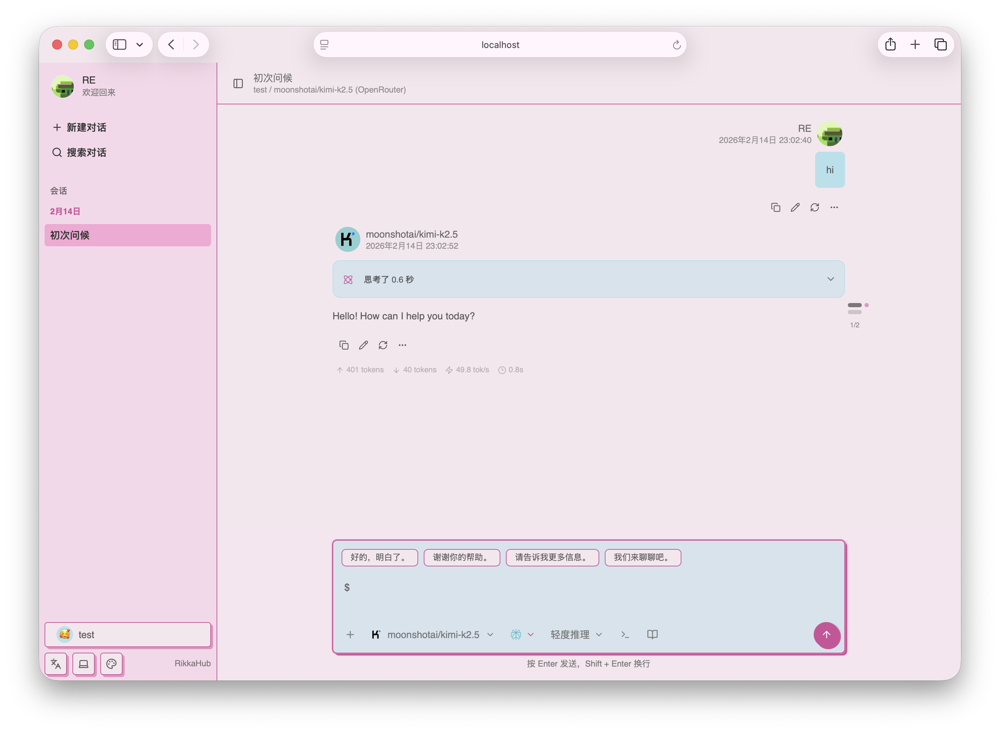

  
  <h1>MGN AI</h1>

一個原生 Android LLM 聊天客戶端，支持切換不同的供應商進行聊天 🤖💬，現已完整支援阿拉伯語 🌙

> MGN AI 是基於 [RikkaHub](https://github.com/rikkahub/rikkahub) 的獨立專案，
> 應用 ID（`com.mgn.ai`）、完整阿拉伯語本地化、應用內語言切換、MGN 主題、
> 透過本倉庫 [Releases](https://github.com/mgnegypt/eg-ai/releases) 的應用內更新，
> 以及 Firebase 遠端捐贈配置。
> 遵循相同的 [AGPL-3.0](LICENSE) 授權發佈。

[English](README.md) | 繁體中文 | [简体中文](README_ZH_CN.md)

  
  

## 🚀 下載

🔗 [從 GitHub Releases 下載](https://github.com/mgnegypt/eg-ai/releases)（推薦）

每個版本提供三個 APK：`mgn-ai-v<VERSION>-arm64-v8a-release.apk`（大多數手機）、
`mgn-ai-v<VERSION>-x86_64-release.apk`、`mgn-ai-v<VERSION>-universal-release.apk`。
套件名 `com.mgn.ai`，可與其他客戶端共存。

## 📇 聯絡開發者

設定 → 關於 → 聯絡開發者：Facebook、WhatsApp、Telegram。

## 💝 捐贈

設定 → 捐贈。捐贈地址透過 Firebase Remote Config（鍵 `donations_config`）遠端配置，
正式地址公佈前應用內顯示「即將推出」。

## ✨ 功能特色

- 🎨 現代化安卓APP設計（Material You / 預測性返回）和 🌙 暗色模式
- 📦 工作區：基於 proot 的 Linux 智能體環境
- 🖥️ Web多端訪問支持
- 🛠️ MCP 支持
- 🔄 多種類型的供應商支持，自定義 API / URL / 模型（目前支持 OpenAI、Google、Anthropic）
- 🖼️ 多模態輸入支持
- 📝 Markdown 渲染（支持代碼高亮、數學公式、表格、Mermaid）
- 🔍 搜尋功能（Exa、Tavily、Zhipu、LinkUp、Brave、Perplexity、..）
- 🧩 Prompt 變量（模型名稱、時間等）
- 🤳 二維碼導出和導入提供商
- 🤖 智能體自定義
- 🧠 類ChatGPT記憶功能
- 📝 AI翻譯
- 🌐 自定義HTTP請求頭和請求體

## ✨ 貢獻

本項目使用[Android Studio](https://developer.android.com/studio)開發，歡迎提交PR

技術棧文檔:

- [Kotlin](https://kotlinlang.org/) (開發語言)
- [Koin](https://insert-koin.io/) (依賴注入)
- [Jetpack Compose](https://developer.android.com/jetpack/compose) (UI 框架)
- [DataStore](https://developer.android.com/topic/libraries/architecture/datastore?hl=zh-cn#preferences-datastore) (
  偏好數據存儲)
- [Room](https://developer.android.com/training/data-storage/room) (數據庫)
- [Coil](https://coil-kt.github.io/coil/) (圖片加載)
- [Material You](https://m3.material.io/) (UI 設計)
- [Navigation 3](https://developer.android.com/guide/navigation/navigation-3) (導航)
- [Okhttp](https://square.github.io/okhttp/) (HTTP 客戶端)
- [kotlinx.serialization](https://github.com/Kotlin/kotlinx.serialization) (Json序列化)

> [!TIP]
> 你需要在 `app` 資料夾下添加 `google-services.json` 檔案才能構建應用。

> [!IMPORTANT]  
> 以下PR將被拒絕：
> 1. 添加新語言，因為添加新語言會增加後續本地化的工作量
> 2. 添加新功能，這個項目是有態度的
> 3. AI生成的大規模重構和更改

## ⭐ Star History

如果喜歡這個項目，請給個Star ⭐

<a href="https://www.star-history.com/?type=date&repos=mgnegypt%2Feg-ai">
 <picture>
   <source media="(prefers-color-scheme: dark)" srcset="https://api.star-history.com/chart?repos=mgnegypt/eg-ai&type=date&theme=dark&legend=top-left&sealed_token=qSytWeq7LkzQQViTjK0MYlvvA_qkfuwjOxOqgbRpLUZZwok5rO6LXhpVL7Mq-q3o89BfKpzE7g66BCy18H6eiqTsD8czD0J-HejLqmHy-npcvCTHu11wZw" />
   <source media="(prefers-color-scheme: light)" srcset="https://api.star-history.com/chart?repos=mgnegypt/eg-ai&type=date&legend=top-left&sealed_token=qSytWeq7LkzQQViTjK0MYlvvA_qkfuwjOxOqgbRpLUZZwok5rO6LXhpVL7Mq-q3o89BfKpzE7g66BCy18H6eiqTsD8czD0J-HejLqmHy-npcvCTHu11wZw" />
   
 </picture>
</a>

## 📄 許可證

本項目基於 [GNU Affero General Public License v3.0](LICENSE) (AGPL-3.0) 開源。

MGN AI 是 [RikkaHub](https://github.com/rikkahub/rikkahub) 的 fork 版本，遵循相同授權發佈，原始版權聲明予以保留。
